# Project 3: Design Journey

**For each milestone, complete only the sections that are labeled with that milestone.** Refine all sections before the final submission. If you later need to update your plan, **do not delete the original plan, leave it place and append your new plan below the original.** Explain why you are changing your plan. Remember you are graded on your design process. Updating the plan documents your process!

**Replace ALL _TODOs_ with your work.** (There should be no TODOs in the final submission.)

Be clear and concise in your writing. Bullets points are encouraged.

**Everything, including images, must be visible in Markdown Preview.** If it's not visible in Markdown Preview, then we won't grade it. We won't give you partial credit either. **Your design journey should be easy to read for the grader; in Markdown Preview the question _and_ answer should have a blank line between them.**


## Design / Plan (Milestone 1)

**Make the case for your decisions using concepts from class, as well as other design principles, theories, examples, and cases from outside of class (includes the design prerequisite for this course).**

You can use bullet points and lists, or full paragraphs, or a combo, whichever is appropriate. The writing should be solid draft quality.

### Audiences (Milestone 1)

> Who are your site's audiences?
> Briefly explain who the intended audiences are for your project website.
> **DO NOT INVENT RANDOM AUDIENCES HERE!** Use the audiences from the requirements.

_Consumer_: parents with developing children

_Site Administrator_: members of the Playful Plants project


### _Consumer_ Audience Goals (Milestone 1)

> Document your audience's goals.
> List each goal below. There is no specific number of goals required for this, but you need enough to do the job.
> **DO NOT INVENT RANDOM GOALS HERE OR STEREOTYPE HERE!** Your goals are things that your users want accomplish when using the site (e.g. print a list of plants). These are informed by the Playful Plants objectives. Review the assignment's requirements for details.

_Consumer_ Goal 1: Find information on the hardiness zone of the plants

- **Design Ideas and Choices** _How will you meet those goals in your design?_
  - I will include this data in the catalog when the user clicks for more details
- **Rationale & Additional Notes** _Justify your decisions; additional notes._
  - n/a

_Consumer_ Goal 2: Find information on whether a certain plant is an annual or a perennial

- **Design Ideas and Choices** _How will you meet those goals in your design?_
  - I will include this data in the catalog when the user clicks for more details
- **Rationale & Additional Notes** _Justify your decisions; additional notes._
  - n/a

_Consumer_ Goal 3: Find information on the type of plant

- **Design Ideas and Choices** _How will you meet those goals in your design?_
  - I will include this data in the catalog
- **Rationale & Additional Notes** _Justify your decisions; additional notes._
  - n/a

_Consumer_ Goal 4: Find information on the sun requirements

- **Design Ideas and Choices** _How will you meet those goals in your design?_
  - I will include this data in the catalog when the use clicks for more details
- **Rationale & Additional Notes** _Justify your decisions; additional notes._
  - n/a


### _Consumer_ Persona (Milestone 1)

> Use the goals you identified above to develop a persona of your site's audience.
> Create your persona using GenderMag's customizable personas.
> Take a screenshot and include it here. Persona must be visible in Markdown Preview; do not use PDF format!

Abi - Consumer Persona
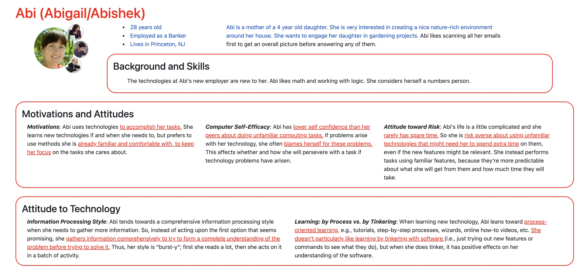
<!-- Source: The GenderMag Project and (original work) Rhea Kak -->
<!-- https://gendermag.org/customizer.php?persona=Abi -->


### _Administrator_ Audience Goals (Milestone 1)

> Document your audience's goals.
> List each goal below. There is no specific number of goals required for this, but you need enough to do the job.
> **DO NOT INVENT RANDOM GOALS HERE OR STEREOTYPE HERE!** Your goals are things that your users want accomplish when using the site (e.g. print a list of plants). These are informed by the Playful Plants objectives. Review the assignment's requirements for details.

_Administrator_ Goal 1: Create a database of playful plants that users can search through

- **Design Ideas and Choices** _How will you meet those goals in your design?_
  - I will employ filtering
- **Rationale & Additional Notes** _Justify your decisions; additional notes._
  - This will accomplish the goal as it provides a smaller subset of the data

Goal 2: Be able to group plants by certain characteristics and play types

- **Design Ideas and Choices** _How will you meet those goals in your design?_
  - I will do this by providing a play type catgeory and letting users sort
- **Rationale & Additional Notes** _Justify your decisions; additional notes._
  - This will make it so the user can see what themes would fit with different plants

Goal 3: Develop a web resource for users to hand pick selections of plants and be able to print and share them

- **Design Ideas and Choices** _How will you meet those goals in your design?_
  - I will create a website with all the important plant information with filter capabilities
- **Rationale & Additional Notes** _Justify your decisions; additional notes._
  - This will make it so the user can tailor selections and print them too


### _Administrator_ Persona (Milestone 1)

> Use the goals you identified above to develop a persona of your site's audience.
> Create your persona using GenderMag's customizable personas.
> Take a screenshot and include it here. Persona must be visible in Markdown Preview; do not use PDF format!

Abi - Administrator Persona
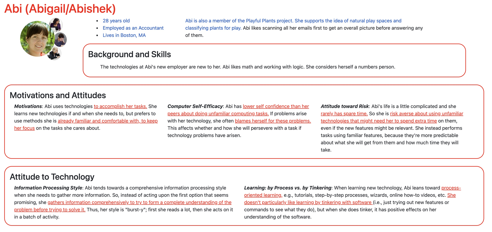
<!-- Source: The GenderMag Project and (original work) Rhea Kak -->
<!-- https://gendermag.org/customizer.php?persona=Abi -->


### Site Design (Milestone 1)

> Document your _entire_ design process. **We want to see iteration!**
> **Show us the evolution of your design from your first idea (sketch) to the final design you plan to implement (sketch).**
> **Show us how you decided what data to display to each audience.**
> **Plan your URLs for the site.**
> **Provide a brief explanation _underneath_ each design artifact (2-3 sentences).** Explain what the artifact is, how it meets the goals of your personas (**refer to your personas by name**).
>
> **Important!** Plan _all_ site requirements. Don't forget login and logout.

_Initial Designs / Design Iterations:_

Consumer
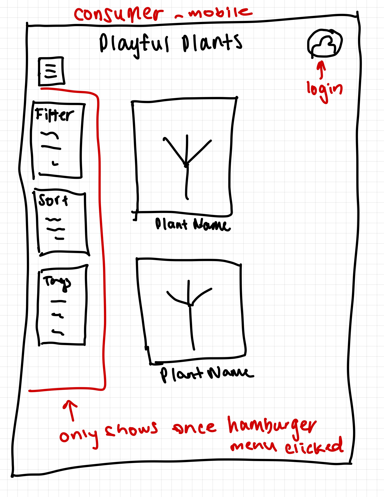
<!-- Source: (original work) Rhea Kak -->
This is the home page for consumers on mobile. This meets Abi's goals as it will allow her to look at multiple plants and sort/filter/tag by what she likes.

Consumer
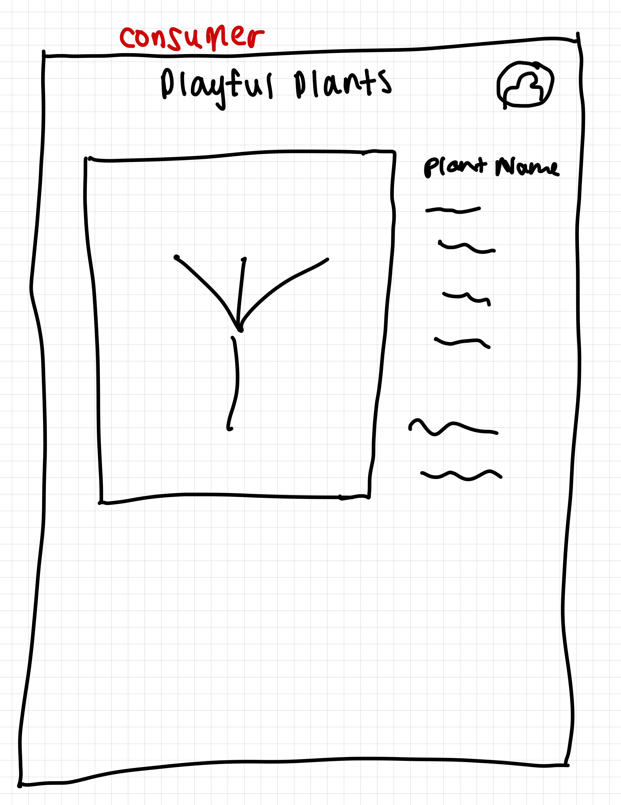
<!-- Source: (original work) Rhea Kak -->
This is the more details page for consumers when they click on a plant. This will help Abi reach her goals by providing all the info on the plants that she needs.

Administrative
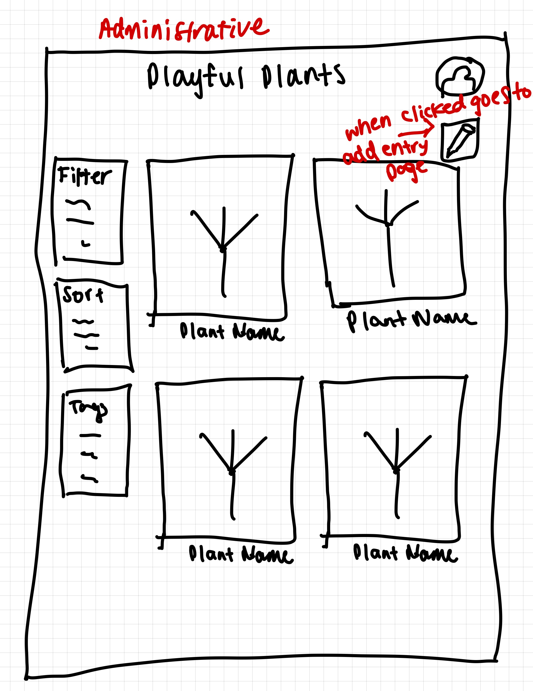
<!-- Source: (original work) Rhea Kak -->
This is the home page for admin use. It will help Abi reach her goals as it will help her group by plant types and add ones as she sees fit.

Administrative
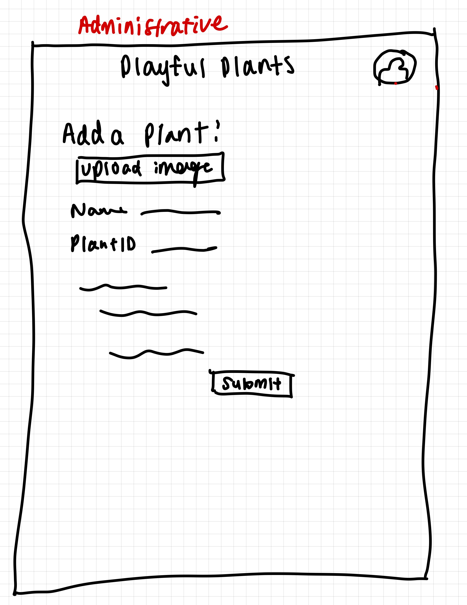
<!-- Source: (original work) Rhea Kak -->
This is the add plant page for admin use. It will help Abi reach her goals as she can make the database of plants bigger.

Administrative
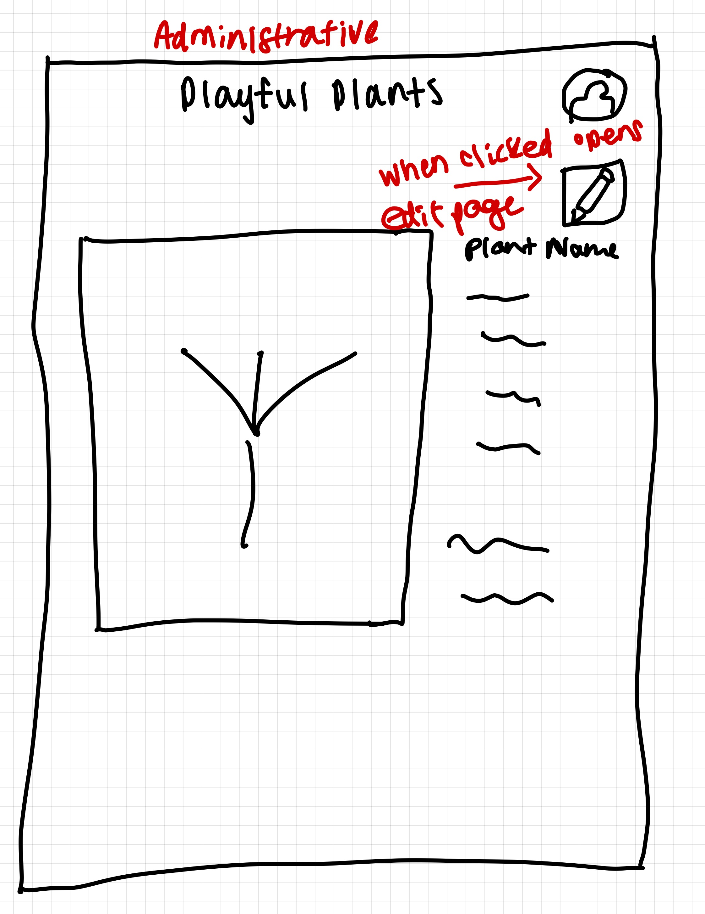
<!-- Source: (original work) Rhea Kak -->
This is the more details page for admin use. It will help Abi reach her goals with the edit feature allowing her to change entires and make the catalog of plants more accurate.

Administrative
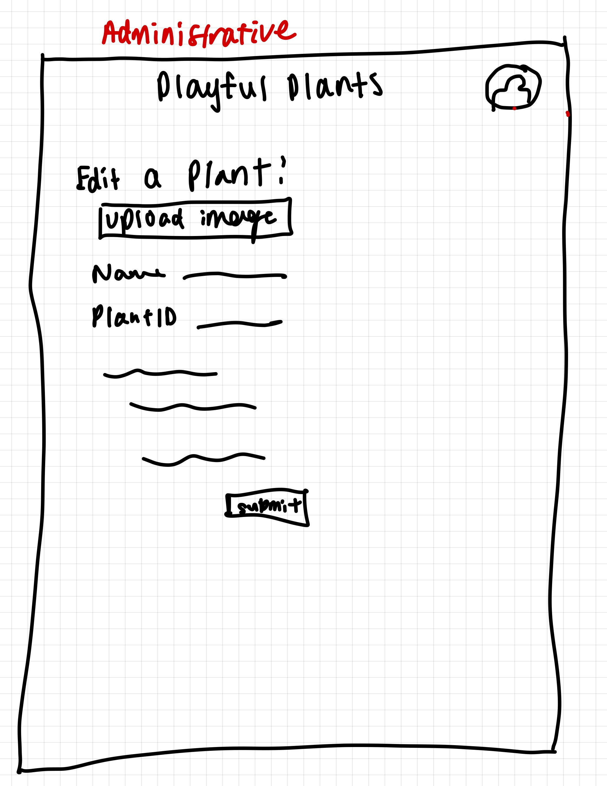
<!-- Source: (original work) Rhea Kak -->
This is the edit page for admin use. It will allow Abi to reach her goals by updating the catalog information.


_Final Design:_

Consumer
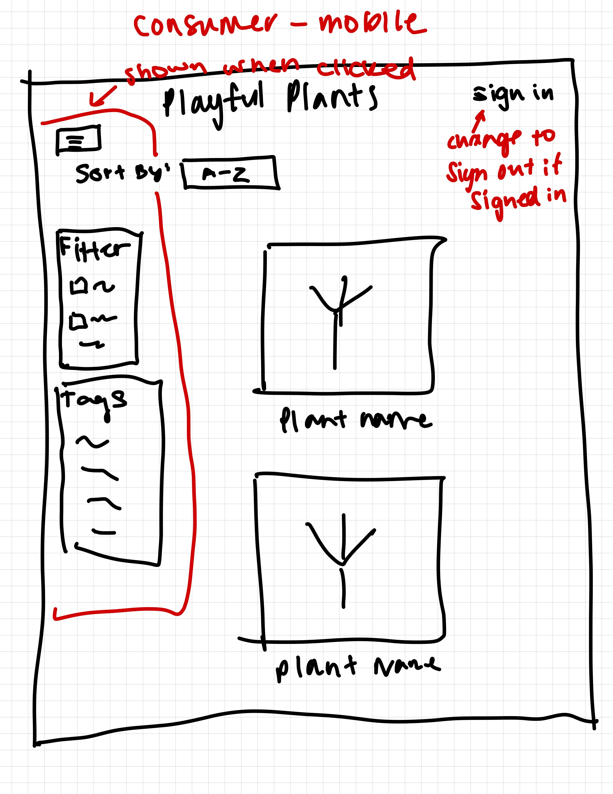
<!-- Source: (original work) Rhea Kak -->
This is the home page for consumers on mobile. This meets Abi's goals as it will allow her to look at multiple plants and sort/filter/tag by what she likes. The sorting is better placed at the top of the page this time and there is a sign in button.

Consumer
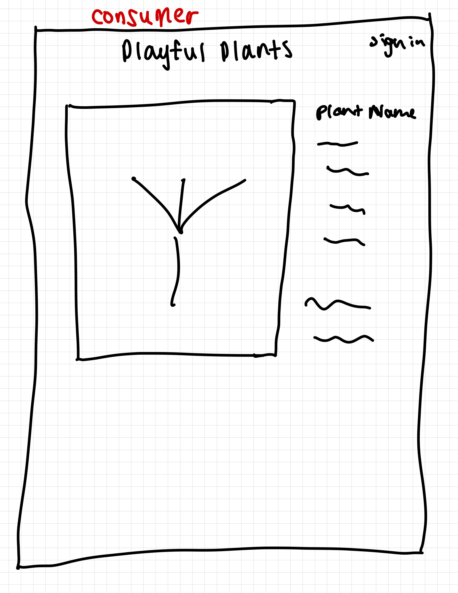
<!-- Source: (original work) Rhea Kak -->
This is the more details page for consumers when they click on a plant. This will help Abi reach her goals by providing all the info on the plants that she needs.

Administrative
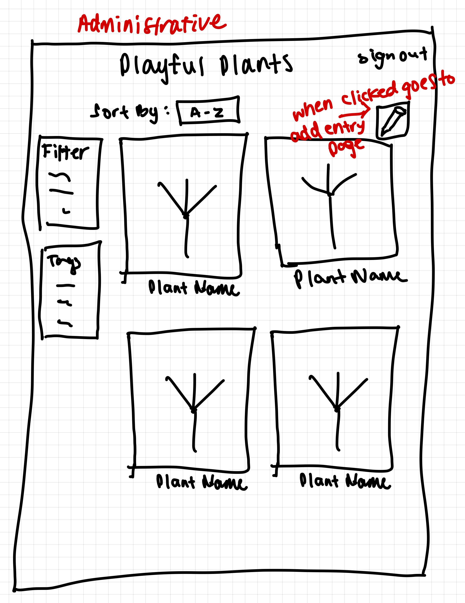
<!-- Source: (original work) Rhea Kak -->
This is the home page for admin use. It will help Abi reach her goals as it will help her group by plant types and add ones as she sees fit. The sort feature is better placed and there is a sign in button.

Administrative
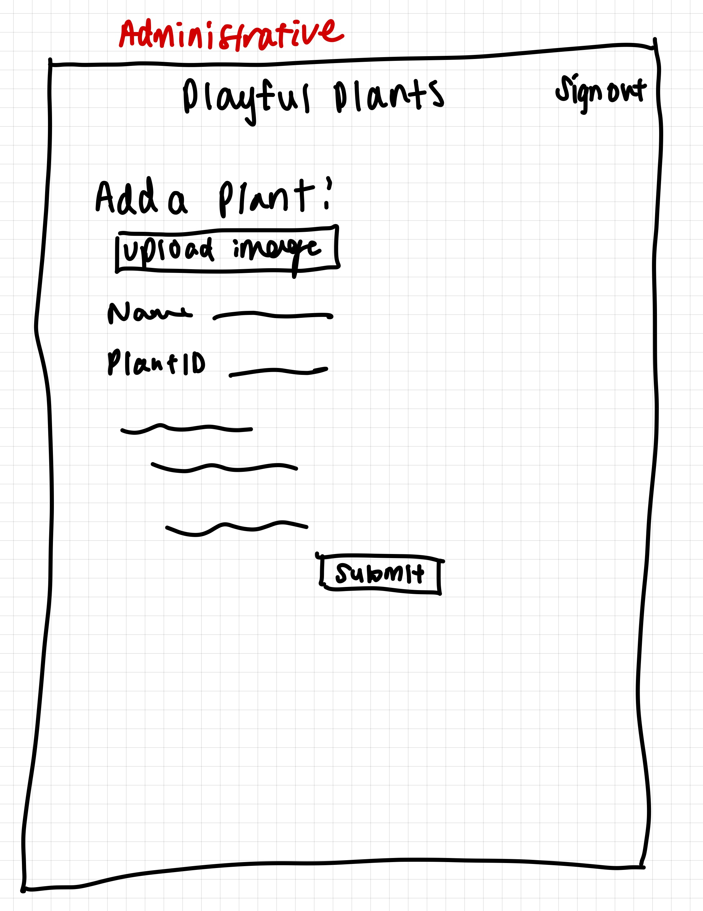
<!-- Source: (original work) Rhea Kak -->
This is the add plant page for admin use. It will help Abi reach her goals as she can make the database of plants bigger.


Administrative
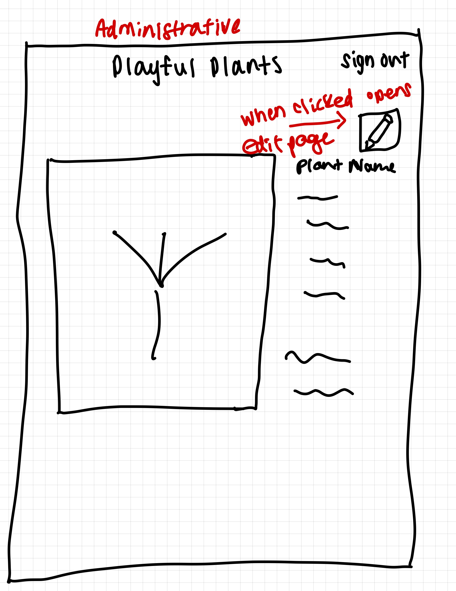
<!-- Source: (original work) Rhea Kak -->
This is the more details page for admin use. It will help Abi reach her goals with the edit feature allowing her to change entires and make the catalog of plants more accurate.

Administrative
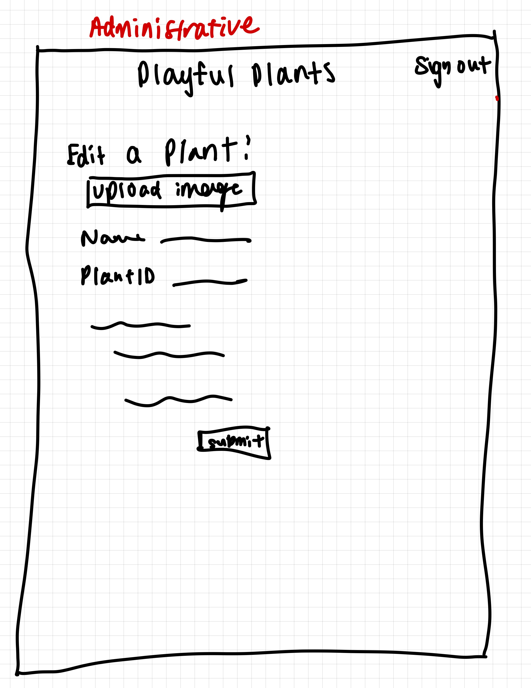
<!-- Source: (original work) Rhea Kak -->
This is the edit page for admin use. It will allow Abi to reach her goals by updating the catalog information.


### Design Pattern Explanation/Reflection (Milestone 1)

> Write a one paragraph (6-8 sentences) reflection explaining how you used design patterns for media catalogs in your site's final design.

I used a lot of design patterns when designing my catalog. One that I used is implementing the sorting on top. This is a classic design pattern used on a lot of websites. Additionally, I implemented filtering and tags which are also classic desgin patterns. Lastly, I implemented a gallery and then more details when clicked. This is a common design pattern especially with catalogs.


### Cognitive Styles Explanation/Reflection (Milestone 1)

> Write a one paragraph (6-8 sentences) reflection explaining how your final design supports the cognitive styles of each persona.

_Consumer Cognitive Styles Reflection:_

Abi likes to use methods she is already comfortable with. Thats why I have implemented many common design patters. She also has low self confidence, which is why i will make all the directions very clear so she doesnt get upset at herself. She is also very risk-averse which is why there wont be anything out of the box or unordinary for her to deal with. She also likes to gather a lot of information before proceeding. Thats why I will make it clear what plant she would like to click on so she knows exactly what information she'll be getting.


_Site Administrator Cognitive Styles Reflection:_

Abi likes to use methods she is already comfortable with. Thats why I have implemented many common design patters. She also has low self confidence, which is why i will make all the directions to edit the tables and add new plants very clear so she doesnt get upset at herself. She is also very risk-averse which is why there wont be anything out of the box or unordinary for her to deal with. All the editing will use clear edit icons and same with adding and delete. She also likes to gather a lot of information before proceeding. Thats why I will make it clear what plant she will be editing and what information will be changed before she presses submit.


## Implementation Plan (Milestone 1, Milestone 2, Milestone 3, Final Submission)

### Database Schema (Milestone 1)

> Describe the structure of your database. You may use words or a picture. A bulleted list is probably the simplest way to do this. Make sure you include constraints for each field.
> **Hint: You probably need a table for "entries", `tags`, `"entry"_tags`** (stores relationship between entries and tags), and a `users` tables.
> **Hint: For foreign keys, use the singular name of the table + _id.** For example: `image_id` and `tag_id` for the `image_tags` (tags for each image) table.

Table: plants

- id: INTEGER {PK, NN, U, AI},
- plant_name: TEXT {NN,U},
- genus: TEXT {NN,U},
- plantid: TEXT {NN,U},
- file_ext: TEXT {NN}

Table: tags

- id: INTEGER {PK, NN, U, AI},
- tag_name: TEXT {NN,U}

Table: users

- id: INTEGER {PK, NN, U, AI},
- username: TEXT {NN,U},
- password: TEXT {NN,U}

Table: play_types

- id: INTEGER {PK, NN, U, AI},
- plant_id: INTEGER {NN,U},
- supports_exploratory_constructive_play: INTEGER {NN},
- supports_exploratory_sensory_play: INTEGER {NN},
- supports_physical_play: INTEGER {NN},
- supports_imaginative_play: INTEGER {NN},
- supports_restorative_play: INTEGER {NN},
- supports_expressive_play: INTEGER {NN},
- supports_play_with_rules: INTEGER {NN},
- supports_bio_play: INTEGER {NN}


Table: cares

- id: INTEGER {PK, NN, U, AI},
- care_name: TEXT {NN,U}

Table: plant_tags

- id: INTEGER {PK, NN, U, AI},
- plant_id: INTEGER {NN, U},
- tag_id: INTEGER {NN, U}

Table: plant_cares

- id: INTEGER {PK, NN, U, AI},
- plant_id: INTEGER {NN, U},
- care_id: INTEGER {NN, U}


### Database Query Plan (Milestone 1, Milestone 2, Milestone 3, Final Submission)

> Plan _all_ of your database queries. You may use natural language, pseudocode, or SQL.

```
plan for details page:

"SELECT plants.id AS 'id', plants.plant_name AS 'plant_name' , plants.genus AS 'genus' , plants.file_ext AS 'file_ext', tags.tag_name AS 'tag_name' , cares.care_name AS 'care_name' FROM plants INNER JOIN plant_tags ON (plants.id = plant_tags.plant_id) INNER JOIN tags ON (tags.id = plant_tags.tag_id)
  INNER JOIN plant_cares ON (plants.id = plant_cares.plant_id) INNER JOIN cares ON (plant_cares.care_id = cares.id)
  WHERE (plants.id = :plantid);"
```

```
for view all consumer
'SELECT * FROM plants'

for admin side:
"SELECT plants.id AS 'id', plants.plant_name AS 'name', plants.genus AS 'genus', plants.plantid AS 'plantid', play_types.supports_exploratory_constructive_play AS 'cons', play_types.supports_exploratory_sensory_play AS 'sens', play_types.supports_physical_play AS 'phys', play_types.supports_imaginative_play AS 'imag', play_types.supports_restorative_play AS 'rest', play_types.supports_expressive_play AS 'exp', play_types.supports_play_with_rules AS 'rules', play_types.supports_bio_play AS 'bio' FROM plants INNER JOIN play_types ON (plants.id = play_types.plant_id);"
```

```
for inserting into the plant_cares table
"INSERT INTO plant_cares(plant_id, care_id) VALUES ((SELECT seq FROM sqlite_sequence WHERE (sqlite_sequence.name = 'plants')), 1);"

for inserting into cares table if care isnt in already
"INSERT INTO cares (care_name) VALUES (:name);"
```

```
for edit form retrieving info:
"SELECT plants.id AS 'id', plants.plant_name AS 'name', plants.genus AS 'genus', plants.plantid AS 'plantid', plants.file_ext AS 'fileext', play_types.supports_exploratory_constructive_play AS 'cons', play_types.supports_exploratory_sensory_play AS 'sens', play_types.supports_physical_play AS 'phys', play_types.supports_imaginative_play AS 'imag', play_types.supports_restorative_play AS 'rest', play_types.supports_expressive_play AS 'exp', play_types.supports_play_with_rules AS 'rules', play_types.supports_bio_play AS 'bio', plant_cares.care_id AS 'careid', plant_tags.tag_id AS 'tagid', tags.tag_name as 'tagname' FROM plants INNER JOIN play_types ON (plants.id = play_types.plant_id) INNER JOIN plant_cares ON (plants.id = plant_cares.plant_id) INNER JOIN plant_tags ON (plants.id = plant_tags.plant_id) INNER JOIN tags ON (tags.id = plant_tags.tag_id) WHERE (plants.id = :id);",
    array(
      ':id' => $edit_id
    )
  )->fetchAll();

```

### Code Planning (Milestone 1, Milestone 2, Milestone 3, Final Submission)

> Plan any PHP code you'll need here using pseudocode.
> Tip: Break this up by pages. It makes it easier to plan.

```
home page:

-the parts of the filter will be a select that will select all the records using *
-the where part will be empty at first but filled in using the filtering discussed above
-the order part will be ordered by id and will be ascending
-sort variable to get the value from dropdown
-use if statements to check what the sort variable is equal to
-make the order by clause equal to whatever the dropdown is

more details page:
-need to be able to edit for admin use

edit/add plant:
-need feedback classes for the form inputs
-variable for each feedback class and set equal to 'hidden'
-need variable to check if the values entered are unique and not already in table
-set them equal to true at first and change later if found that value in table already

```

```
for details page:
-need a join to combine cares and plant_cares, tags and plant_tags and plant_id with them too
-need to loop through the cares as theres multiple entries per plant

for consumer page:
-just need to display the plant image and the plant name
-make it clickable and go to the details page of the plant
-use query string params to get the plant id and link to the details page
```

```
-for the consumer page need to display generic plant if file path isnt in directory
-for the home page we need to change the filtering and add form to support multiple tables and add into multiple tables
```

```
-for the user login logout:
-on the press of sign in, go to the login page and present the login form
-if user is logged in, only then display admin info
-if user is loggin in change header to sign out instead

```

```
-for editing entries
-same form as add but retrieve all the current values use query string parameter
-upload image using file upload protocols
-image not sticky
-make sure to delete tags if admin changes tags
```


### Accessibility Audit (Final Submission)

> Tell us what issues you discovered during your accessibility audit.
> What do you do to improve the accessibility of your site?

I had to fix some contrast issues. This made it easier for Abi to read the information


## Reflection (Final Submission)

### Audience (Final Submission)

> Tell us how your final site meets the goals of your audiences. Be specific here. Tell us how you tailored your design, content, etc. to make your website usable for your personas.

My final site meets the goals of both of my audiences. For the administrative audience, I included edit, delete and insert capabilities. These are clearly marked with labels and icons so Abi knows exactly what to expect and where to click. I also included messages confirming editing, adding, and deleting to reassure Abi that she was successful in completing the task. Additionally there is a login/logout feature clearly labeled near the top.

For the consumer audience, I clearly laid out the plants in a catalog with options to filter by tags and sort. Additionally, the underline on the plant names makes it clear to Abi that she can click those for more details. There is also a title header that lets Abi return to the catalog at any time.


### Additional Design Justifications (Final Submission)

> If you feel like you haven’t fully explained your design choices in the final submission, or you want to explain some functions in your site (e.g., if you feel like you make a special design choice which might not meet the final requirement), you can use the additional design justifications to justify your design choices. Remember, this is place for you to justify your design choices which you haven’t covered in the design journey. You don’t need to fill out this section if you think all design choices have been well explained in the design journey.

To clarify: the multiple tags requirement is met. When inserting or editing a plant, the admin can create a plant with multiple tags and add/remove tags when editing and these will show up in the details section of the plant when it’s clicked on, on the consumer side. However, I didn’t include ALL the tags on the left hand side of the consumer page as I believed this was cluttering the page and the filtering lost it’s value. I believe a small selection of filtering by tags will let Abi easily view all the entries associate with those tags, while being able to clearly understand and not get confused by a cluttered page.


### Self-Reflection (Final Submission)

> Reflect on what you learned during this assignment. How have you improved from Project 2? What would you do differently next time?

I learned a lot about efficiently querying and using strategies to increase efficiency such as JOINS. I’ve improved from Project 2 a lot in that I have a much better understanding of how databases work and how to initialize them. Next time I would try to structure my database more efficiently from the start to avoid complicated queries.


> Take some time here to reflect on how much you've learned since you started this class. It's often easy to ignore our own progress. Take a moment and think about your accomplishments in this class. Hopefully you'll recognize that you've accomplished a lot and that you should be very proud of those accomplishments!

I’ve learned so much since I started this class. I walked in with no knowledge of databases or SQL or php. I’ve created a very impressive portfolio piece and i’m excited to share it.


### Grading: Step-by-Step Instructions (Final Submission)

> Write step-by-step instructions for the graders.
> The project if very hard to grade if we don't understand how your site works.
> For example, you must login before you can delete.
> For each set of instructions, assume the grader is starting from /

_View all entries:_

1. The starting page “/“ has all the entries with their pictures.

_View all entries for a tag:_

1. Select the tag of choice from the left hand side menu

2. Click apply

_View a single entry's details:_

1. Click the entry’s name or click the image associated with it (name is underlined)


_How to insert and upload a new entry:_

1. Click sign in on top right
2. login with username: rhea and password: monkey
3. scroll down to the add a new plant form
4. fill out the form
5. click submit

_How to delete an entry:_

1. Click sign in on top right
2. login with username: rhea and password: monkey
3. find the plant you wish to delete
4. press the trash icon to the right of it

_How to edit and existing entry and its tags:_

1. Click sign in on top right
2. login with username: rhea and password: monkey
3. find the plant you wish to edit
4. press the edit icon to the right of it
5. edit whatever information/tags
6. press submit
7. return to catalog
